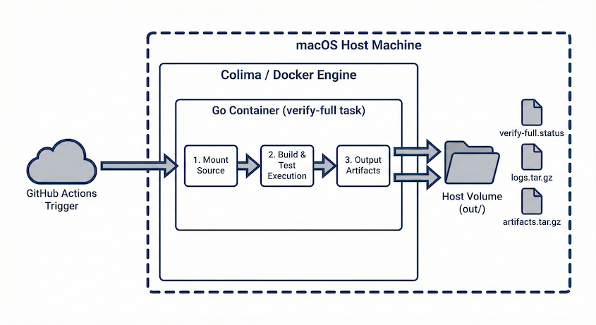

# runner-kit (self-hosted runner + colima + docker)

※Mac OS only

GitHub を「計算機」ではなく「公証台帳」に寄せる運用キットです。  
検証の主処理は Mac mini（self-hosted + colima + docker）で実行し、PRは最後に作成します。

## Scope（重要）

- このリポジトリは **個人運用（single-owner）専用** です
- self-hosted runner は **自分のリポジトリ/自分の変更** に限定して使います
- 外部コラボ・外部PR・fork PR の実行用途は想定しません
- 上記を外れて運用する場合は、`docs/ci/SECURITY_HARDENING_TASK.md` を先に満たしてください
- GitHub Actions の self-hosted 実行は `SELF_HOSTED_OWNER` 変数一致時のみ有効です

## 理想系（2コマンド運用）

最初の1回だけ（CLIインストール）:

```bash
cd ~/dev/ci-self-runner
bash ops/ci/install_cli.sh
```

### ローカル版（自分マシン Self-Hosted）

```bash
cd ~/dev/maakie-brainlab
ci-self register
ci-self run-focus
```

### ローカルネットワーク編（MacBook -> 同一LANの Mac mini）

```bash
cd ~/dev/maakie-brainlab
ci-self remote-up --host <mac-mini-host> --project-dir ~/dev/maakie-brainlab --repo mt4110/maakie-brainlab
```

### リモートネットワーク編（外出先）

```bash
# どこからでも (SSHあり): Mac mini 上で register + run-focus を1コマンド実行
ci-self remote-up --host <mac-mini-remote-host> --project-dir ~/dev/maakie-brainlab --repo mt4110/maakie-brainlab

# どこからでも (SSHなし): dispatch + All Green確認 + PRテンプレ同期のみ実行
ci-self run-focus --repo mt4110/maakie-brainlab --ref main
```

`ci-self register` が実施すること:

1. `colima` 起動確認
2. runner 登録（repo指定で token 自動取得）
3. `runner_health`
4. `SELF_HOSTED_OWNER` 変数設定
5. カレントプロジェクトに `verify.yml` を生成（必要時）

`ci-self run-focus` が実施すること:

1. `verify.yml` dispatch
2. 実行結果 watch（失敗なら即終了）
3. PR checks を All Green まで watch
4. PRテンプレートを検出して PR title/body を自動同期（テンプレートがある場合）

`ci-self remote-up` が実施すること:

1. SSH で Mac mini に接続
2. `ci-self register` を実行
3. `ci-self run-focus` を実行

これで `Copilot review` / `Codex review` に集中できます。

補足:

- `remote-*` は接続先Macに `ci-self`（`bash ops/ci/install_cli.sh` 実行済み）が必要です
- `--project-dir` 未指定時は `~/dev/<現在のリポジトリ名>` を使います

## Production QuickStart（実稼働用）

詳細: `docs/ci/QUICKSTART.md`

```bash
# 0) 再起動直後は docker runtime を復帰
colima status || colima start

# 1) Runner セットアップ（初回のみ・冪等）
#    - gh auth が有効なら registration token を自動取得して登録まで実行
go run ./cmd/runner_setup --apply --repo <owner/repo>

# 2) 健康診断
go run ./cmd/runner_health

# 3) 軽量検証（ホストラッパ経由）
go run ./cmd/verify_lite_host

# 4) フル検証 dry-run（ホストラッパ経由）
go run ./cmd/verify_full_host --dry-run
```

SOT（判定の真実）: `out/runner-setup.status`, `out/health.status`, `out/verify-lite.status`, `out/verify-full.status`

runner を1コマンド登録（最短）:

```bash
go run ./cmd/runner_setup --apply --repo mt4110/maakie-brainlab
```

補足:

- デフォルト install 先は `~/.local/ci-runner-<owner>-<repo>`（repoごとに分離）
- `RUNNER_TOKEN` を渡さない場合は `gh api` で registration token を自動取得
- オプション: `--labels`, `--name`, `--runner-group`, `--install-dir`, `--no-service`

## 最短 1-2-3（運用手順）

### 0) 初回だけ（対象リポジトリごと）

```bash
# 必須: ownerガード
gh variable set SELF_HOSTED_OWNER -b "$(gh repo view --json owner --jq .owner.login)" -R <owner/repo>

# 任意: 失敗通知
printf '%s' '<paste-discord-webhook-url-here>' | gh secret set DISCORD_WEBHOOK_URL -R <owner/repo>
```

### 1) ローカル事前検証

```bash
mise x -- go run ./cmd/verify-lite
mkdir -p out cache
REPO_DIR='.' OUT_DIR='out' CACHE_DIR='cache' mise x -- go run ./cmd/verify-full --dry-run
```

失敗時は `out/verify-lite.status` / `out/verify-full.status` の `ERROR:` 行を確認。

### 2) GitHub Actions 実行

```bash
gh workflow run verify.yml --ref main -R <owner/repo>
```

### 3) 完了待ち（成功/失敗を確定）

```bash
RUN_ID="$(gh run list --workflow verify.yml -R <owner/repo> --limit 1 --json databaseId --jq '.[0].databaseId')"
gh run watch "$RUN_ID" -R <owner/repo> --exit-status
```

複数リポジトリ運用時は毎回 `-R <owner/repo>` を変えるだけです。

注意:

- `gh workflow run verify.yml ...` は、対象リポジトリに `.github/workflows/verify.yml` が存在しないと 404 になります。
- 先に対象リポジトリへ workflow を作成してコミットしてください。

workflow を1コマンドで生成（`ci-self-runner` リポジトリから実行）:

```bash
bash ops/ci/scaffold_verify_workflow.sh --repo ~/dev/maakie-brainlab --apply
```

生成後は対象リポジトリでコミット:

```bash
cd ~/dev/maakie-brainlab
git add .github/workflows/verify.yml .gitignore
git commit -m "ci: add self-hosted verify workflow"
git push
```

## system architecture flow

  

## 入口ドキュメント

- `docs/ci/QUICKSTART.md`（実稼働 QuickStart）
- `docs/ci/QUICKSTART_PLAN.md`（設計 SOT）
- `docs/ci/RUNNER_LOCK.md`（Runner バージョン固定）
- `docs/ci/SYSTEM.md`
- `docs/ci/FLOW.md`
- `docs/ci/RUNNER_ISOLATION.md`
- `docs/ci/COLIMA_TUNING.md`
- `docs/ci/SHELL_POLICY.md`
- `docs/ci/SECRETS_POLICY.md`
- `docs/ci/DISCORD_NOTIFICATIONS.md`
- `docs/ci/GARBAGE_COLLECTION.md`
- `docs/ci/RUNBOOK.md`
- `docs/ci/SECURITY_HARDENING_PLAN.md`
- `docs/ci/SECURITY_HARDENING_TASK.md`

## 前提セットアップ（初回）

```bash
mise trust
mise install
```

## Quick Start（最短）

```bash
# 1) 軽量検証（公式推奨: gofmt/vet/test）
mise x -- go run ./cmd/verify-lite

# 2) フル検証（dry-run）
mkdir -p out cache
REPO_DIR='.' OUT_DIR='out' CACHE_DIR='cache' mise x -- go run ./cmd/verify-full --dry-run

# 3) レビューパック（core）
mise x -- go run ./cmd/review-pack --profile core

# 4) optional版レビューパック（必要時のみ）
mise x -- go run ./cmd/review-pack --profile optional

# 5) Discord通知のdry-run（Webhook送信なし）
DISCORD_WEBHOOK_URL='https://example.invalid/webhook' mise x -- \
  go run ./cmd/notify_discord --dry-run --status out/verify-full.status --title "verify-full local" --min-level ERROR
```

## 実行フロー（推奨）

1. MacBookで `verify-lite`
2. Mac miniで `verify-full`（または `remote_verify --mode remote`）
3. `review-pack --profile core` で提出パック生成
4. 必要時のみ `review-pack --profile optional`
5. 検証後にPR作成（GitHubは証跡の公証台帳）

## 外出先から Mac mini self-hosted runner を使う

前提:

- Mac mini が起動中
- runner が `online`
- colima / docker が動作中

ポイント:

- 外出先でも、GitHubへアクセスできれば `workflow_dispatch` と `PR` は実行可能です。
- self-hosted runner は GitHub 側へ取りに行く方式なので、通常は「自宅回線への公開ポート」は不要です。
- ただし runner 本体が停止している場合、復旧には Mac mini への遠隔管理手段（例: Tailscale + SSH）が必要です。

まず状態確認:

```bash
ssh <mac-mini-host> 'colima status || colima start'
gh api repos/<owner/repo>/actions/runners --jq '.runners[] | {name,status,busy}'
```

外出先から検証を流す:

```bash
ci-self run-focus --repo <owner/repo> --ref main
```

runner が offline / colima停止で失敗した場合の復旧例（SSH可能時）:

```bash
ci-self remote-register --host <mac-mini-host> --project-dir ~/dev/<repo> --repo <owner/repo>
ci-self remote-run-focus --host <mac-mini-host> --project-dir ~/dev/<repo> --repo <owner/repo> --ref main
```

## ローカル/リモート実行

### verify-full（ローカル）

`verify-full.status` に `GITHUB_RUN_ID / GITHUB_SHA / GITHUB_REF_NAME` を記録したい場合:

```bash
go run ./cmd/remote_verify --mode local
```

生成物:

- `out/verify-full.status`
- `out/logs/`
- 実行後に `out/logs` は自動で最新5件に整理

### verify-full（MacBook -> SSH -> Mac mini）

```bash
go run ./cmd/remote_verify \
  --mode remote \
  --remote-host <ssh-host-alias> \
  --remote-repo <remote-repo-path>
```

回収される生成物:

- `out/remote/verify-full.status`
- `out/remote/logs/`

## CIオーケストレーター（Go）

```bash
go run ./cmd/ci_orch run-plan --timebox-min 20
```

個別ステップ実行:

```bash
go run ./cmd/ci_orch preflight
go run ./cmd/ci_orch verify-lite
go run ./cmd/ci_orch full-build
go run ./cmd/ci_orch full-test
go run ./cmd/ci_orch bundle-make
```

## Discord通知（ローカル確認）

- 通知は外部Actionを使わず `cmd/notify_discord`（Go）で送信
- 既定は `--min-level ERROR`（ERROR時のみ送信）

Secret設定（GitHub Actions）:

```bash
printf '%s' '<paste-discord-webhook-url-here>' | gh secret set DISCORD_WEBHOOK_URL -R <owner/repo>
```

ownerガード変数（必須）:

```bash
gh variable set SELF_HOSTED_OWNER -b "$(gh repo view --json owner --jq .owner.login)" -R <owner/repo>
```

dry-run（Webhook送信せずpayload確認）:

```bash
go run ./cmd/notify_discord --dry-run --status out/verify-full.status --title "verify-full local" --min-level ERROR
```

将来拡張（任意）:

- 基本はテキスト通知（run URL中心）
- 将来ログ添付を行う場合は、秘匿情報マスクとサイズ制限を先に定義してから有効化

## レビューパック（ChatGPT / Gemini）

### 必須（core）

```bash
go run ./cmd/review-pack --profile core
```

生成物:

- `out/reviewpack/review-pack-<UTC>.tar.gz`
- `out/reviewpack/latest.tar.gz`
- `out/reviewpack/review-pack-<UTC>/PACK_SUMMARY.md`
- `latest.tar.gz` はエイリアス/シンボリックリンクではなく実体ファイル（copy）です

### Optional（追加証跡を含む）

```bash
go run ./cmd/review-pack --profile optional
```

生成物:

- `out/reviewpack/review-pack-optional-<UTC>.tar.gz`
- `out/reviewpack/latest-optional.tar.gz`
- `out/reviewpack/review-pack-optional-<UTC>/PACK_SUMMARY.md`
- `latest-optional.tar.gz` も実体ファイル（copy）です
- 実行後に `out/reviewpack` は自動で最新5件に整理（`latest*.tar.gz` は保持）

実体確認コマンド:

```bash
ls -l out/reviewpack/latest.tar.gz out/reviewpack/latest-optional.tar.gz
file out/reviewpack/latest.tar.gz out/reviewpack/latest-optional.tar.gz
```

## GC（out配下の整理）

dry-run:

```bash
go run ./cmd/gc_out
```

既定: `out/logs` と `out/reviewpack` は最新5件保持。

実削除:

```bash
go run ./cmd/gc_out --apply --max-delete 50
```

## Git管理しないもの

- `out/`（ログ、status、reviewpack成果物）
- `.local/`（ローカル state / 実行履歴）
- `cache/`（ローカルキャッシュ）

## 公開前チェック（最短）

```bash
mise x -- go test ./...
mise x -- go run ./cmd/verify-lite
REPO_DIR='.' OUT_DIR='out' CACHE_DIR='cache' mise x -- go run ./cmd/verify-full --dry-run
mise x -- go run ./cmd/review-pack --profile core
```
